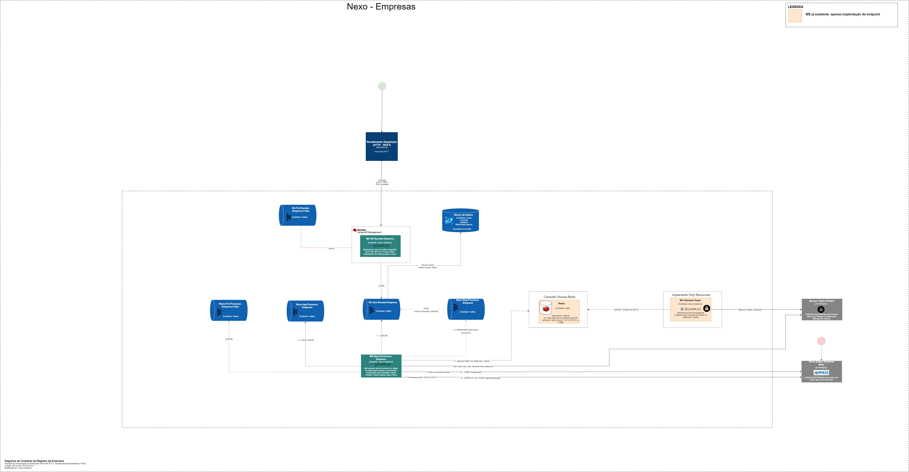

**Arquitetura Nexo Integração Empresas**
=======

**Objetivo**
------------

Objetivo da documentação é descrever o stack tecnológico, premissas e
modelo de implementação da integração para o Nexo Empresas.

Low Level Design
----------------

Low level design serve como base para as descrições do modelo de
integração e tecnologias que serão utilizadas durante a fase de
implementação toda comunicação entre os microserviços são HTTPS e suportado versão 1.2 e 1.3 vTLS.




Stack tecnológico
-----------------
- 3Scale API management 2.11;
- Camel Quarkus 2.6.1;
- Cosmos DataBase;
- Red Hat Service Mesh 2.5.6;
- Kafka Connect;
- Kafka Stream;
- Kafka KSQLDB;

Fluxos de implementação
-----------------------

- Segue documentação do Projeto: [Documentação Projeto](payloads/documentacao.docx).
- Segue documentação DE/PARA: [Documentação DE/PARA](payloads/DE-PARA.xlsx).
- Segue Collection Geral: [Collection Geral](payloads/collectionGeral.json).
- Payload savo base redis: [Payload savo base redis](payloads/redisNexo.txt).
- Informações conexões Redis: [Informações conexões Redis](payloads/informacoesRedis.txt).

##### **Fluxo: Rh-Recebe-Empresa**

1. Criar ```Rh-Recebe-Empresa```: Microserviço responsável por disponibilizar um proxy que receberá requisições REST vinda do SAP ECC PI (Sistema Empresa) Exemplo: [Chamada que receberemos](payloads/openApiEntrada.txt) para recebimento de informações de empresa;
2. Criar tópico ```rh-fct-recebe-empresa-falha```;
3. Configurar o microserviço para enviar de mensagem recebida via HTTP/REST para o tópico ```rh-sys-recebe-empresa``` segue o exemplo que como será a estrutura da mensagem: [Json recebido via HTTP/REST](payloads/jsonEntradaProcessa.txt), O payload que deverá ser publicado no tópico ```rh-sys-recebe-empresa``` terá que ser adicionado dois campos, são eles: ```data: dd/mm/yyyy HH:mm:SSS ``` e  ```id: x-correlation-id ```; 
4. Configurar produtor no Apache Camel;
5. Configurar backend e produto no 3scale mapeando definições do microserviço ```rh-recebe-empresa```;
6. Configurar o microserviço para enviar as mensagens de erro tratadas ao tópico ```rh-fct-recebe-empresa-falha``` com o seguinte payload [Payload padrão de falha ](payloads/jsonFalha.yml);
7. Criar Kafka Connect para envio das mensagem que chega no tópico: ```rh-sys-recebe-empresa``` para o Azure ComosDB no container ```RhRecebeEmpresa```, criar um campo id no payload para que seja inserido o value do x-correlation-id;
8. Gerar correlationId para ser enviado para o microserviço ``` nexo-processa-empresa``` no formato de objeto XcorrelationId inserindo no header;
9. Caso o atributo ```codigo```, ```nome```, ```nomeFantasia```, ```desativada``` vier vazio o Ms ```rh-recebe-empresa``` irá enviar uma mensagem para o tópico de falha ```rh-fct-recebe-empresa-falha``` informando que esses atributos não foram informados, é o fluxo não seguira adiante, segue o formato do payload [Payload de response que deverá ser retornado ao cliente](payloads/jsonErrorResponse.txt) é de devolver um statusCode 400.
10. Gerar correlation é inserir no header do kafka.
11. Criar campo data para que essa informação seja enviada ao cosmosDB. Seguir o padrão ```data: dd/mm/yyyy HH:mm:SSS```

##### **Fluxo: Microserviço Schedule-Token**

1. O ```Microserviço Schedule-Token```  ira realizar a chamada para busca de token no nexo, Exemplo: [URI Token OAuth2](payloads/gerarToken.yml) e será reponsável por agendar é sempre renovar o token quando necessário. As informações de token será disponibilizado em base do redis: [Conexões Redis](payloads/informacoesRedis.txt). O token será salvo em uma base de dados com o nome da chave de nexo, segue o exemplo que como será salvo o token: [Payload token redis](payloads/redisNexo.txt).

##### **Fluxo: Microserviço Nexo-Processa-Empresa**

1. ```Nexo-Processa-Empresa```: Microserviço responsavél por consumir o tópico ```rh-sys-recebe-empresa``` realizar o DE/PARA do payload recebido via HTTP/REST do SAP CSS PI para enviar os dados para o endpoint do Nexo. Segue o documento para realizar o DE/PARA para envio ao Nexo Empresa Exemplo: [Documentação DE/PARA](payloads/DE-PARA.xlsx). obs: os atributos que não estiverem na documentação de DE/PARA deveram ser suprimidos. Obs: deverá ser removido do payload de entrada os campos ```data``` e ```id```. Respeitar sempre a documentação DE/PARA para enviar os dados para o Nexo. Exemplo do payload que será publicado: [Payload publicado no tópico:](payloads/jsonEntradaProcessa.txt).
2. Realizar consulta no banco de dados do  Redis usando chave  ```nexos-all-apps-token-api``` para obtenção de token. O ```MS: schedule-token``` será responsavél por inserir o token nessa fonte de dados na chave nexo. [Segue o payload que será inserido:](payloads/redisNexo.txt)  [Segue informações para autenticação no redis:](payloads/informacoesRedis.txt). 
3. Criar tópico ```nexo-fct-processa-empresa-falha```;
4. Relizar uma consulta no sistema Nexo para verificar se a empresa já existe, caso a consulta retorne uma empresa o metodo a ser enviado no proximo passo é o PATCH, caso a consulta não retorne nada deverá enviar um POST. Segue exemplos de como realizar a consulta de empresa: [Curl para realizar a consulta de empresa](payloads/Buscar-getEmpresas.yml).
5. Relizar envio do payload via HTTP/REST já convertido para o modelo do Sistema Nexo conforme mostrado na documentação: Exemplo: [Documentação DE/PARA](payloads/DE-PARA.xlsx) para o endpoint do sistema Nexo segue a url de comunicação com o endpoint é os parâmetros de conexão  Exemplo: [URL e Parametros Envio Requisição Nexo POST](payloads/Cadastrar-postEmpresa.yml), caso seja PATCH [URL e Parametros Envio Requisição Nexo PATCH](payloads/Alterar-patchEmpresa.yml).
6. Criar tópico kafka ```nexo-log-processa-empresa```: para envio de um payload padrão conforme esse body: [Logging gerado](payloads/jsonLogging.txt) para que possamos ter logging que enviamos a requisição com sucesso ao sistema do Nexo.
7. Criar tópico ```nexo-fct-processa-empresa-falha``` para que o sistema envie qualquer falha que venha ocorrer no ```Microserviço Nexo-Processa-Empresa``` para este tópico, conforme payload já definido: [Mensagem de falha](payloads/jsonFalha.yml)
8. Criar é configurar Ksqldb para que se houver qualquer requisição com falha no range de 5xx para o ```Microserviço Nexo-Processa-Empresa``` venha enviar a mensagem para o tópico ```nexo-rep-processa-empresa```. Onde foi configurado o Ksqldb. Foi criado as seguintes streams: ```KSQLDB: nexo_processa_empresa_fallback``` e o ```Kafka Stream: nexo_processa_empresa```
9. Criar é configurar o Kafka Stream para que a mensagem que seja enviada ao tópico ```nexo-rep-processa-empresa``` seja reprocessado para o fluxo de continuidade enviado a mensagem para o tópico: ```rh-sys-recebe-empresa``` assim sendo reprocessado a mensagem até que o endpoint do Nexo volte a funcionar.
10. Inserir o xCorrelationId no header do kafka
11. Caso ocorrer um erro ao buscar o token no projeto schedule-token, o MS ```Nexo-Processa-Empresa``` deverá ter a capacidade de buscar o token OAuth no endpoint do Nexo Empresa, sem se preocupar em manter ele guardado. Essa opção deverá ser respeitada até que o Schedule-token volte ao normal. Segue o curl de como realizar a busca do token:  Exemplo: [[URI Token OAuth2](payloads/gerarToken.yml).

Detalhamentos Técnicos: 
---------------------


##### **Fluxo: Microserviço Rh-Recebe-Empresa**

1. ```Rh-Recebe-Empresa```: Microserviço em Camel Quarkus que deverá criar rotas para disponibilizar proxy que será mapeado no 3Scale e
    receberá requisições REST (POST:/empresa é retorna 204 Accept) do sistema SAP ECC PI, Segue um exemplo de como iremos receber essa chamada:  Exemplo: [Chamada que receberemos](payloads/openApiEntrada.txt). O microserviço deverá ser criado utilizando arquetype [Camel Quarkus](https://link); 

2. Criar tópico kafka de falha ```rh-fct-recebe-empresa-falha```; para que qualquer falha de execução ou exceção seja enviado um json para o tópico kafka conforme padrão já definido  Exemplo: [Json padrão de falha ](payloads/jsonFalha.yml)

3. Configurar em Camel Quakus um kafka Producer para que a mensagem enviada via HTTP/REST do sistema do SAP CSS PI seja enviada para o tópico ``` rh-sys-recebe-empresa``` conforme payload recebido: [Json recebido via HTTP/REST](payloads/jsonEntradaProcessa.txt). O payload que deverá ser publicado no tópico ```rh-sys-recebe-empresa``` terá que ser adicionado dois campos, são eles: ```data: dd/mm/yyyy HH:mm:SSS ``` e  ```id: x-correlation-id ```;

4. Configurar Apache camel Producer.

5. Criar Produto e backend no 3scale mapenado definições do microserviços ```Rh-Recebe-Empresa```;

6. Criar tópico kafka de falha ```rh-fct-recebe-empresa-falha```; para que qualquer falha de execução ou exceção seja enviado uma json para o tópico kafka conforme padrão já definido  Exemplo: [Json de Falha](payloads/jsonFalha.yml)

7. Configurar kafka connect na confluent para que possa enviar mensagem de evento que cheguem no tópico ```rh-sys-recebe-empresa``` para o Azure Cosmosdb no container ```rhRecebeEmpresa```;

8. Gerar o atributo XcorrelationId para ser propagado entre os microserviços no padrão UUID4 e enriquecer o fluxo (será avaliado ainda).

9. Caso o atributo ```codigo```, ```nome```, ```nomeFantasia```, ```desativada``` vier vazio o Ms ```Rh-Recebe-Empresa``` irá enviar uma mensagem para o tópico de falha ```rh-fct-recebe-empresa-falha``` informando que esses atributos não foram informados, é o fluxo não seguira adiante, segue o formato do payload [Payload de response que deverá ser retornado ao cliente](payloads/jsonErrorResponse.txt) é de devolver um statusCode 400.

10. Criar o campo x-correlation-id gerado na versão UUID4 é inserir no header do kafka para que esse campo seja propado.

11. Criar um campo data no formatdo dd/mm/yyyy HH:mm:SSS para informar o horario que o evento foi gravado no cosmosdb.


##### **Fluxo: Microserviço Schedule-Token**

1. O ```Microserviço Schedule-Token```  ira realizar a chamada para busca de token no nexo, Exemplo: [URI Token OAuth2](payloads/gerarToken.yml) e será reponsável por agendar é sempre renovar o token quando necessário. As informações de token será disponibilizado em base do redis: [Conexões Redis](payloads/informacoesRedis.txt). O token será salvo em uma base de dados com o nome da chave de nexo, segue o exemplo que como será salvo o token: [Payload token redis](payloads/redisNexo.txt).

Obs: Caso a busca de token esteja invalida, o MS deverá buscar de forma autonama o token direto na fonte do nexo.


##### **Fluxo: Microserviço Nexo-Processa-Empresa**

1. ```Nexo-Processa-Empresa```: Microserviço em Camel Quarkus que deverá criar um Camel Producer que irá consumir o tópico  ```rh-sys-recebe-empresa``` e realizar a transformação do objeto DE/PARA recebido via HTTP/REST do SAP CSS PI. Segue o documento para realizar o DE/PARA para envio ao D1(Done) Exemplo: [Documentação DE/PARA](payloads/DE-PARA.xlsx). Exemplo do payload que será publicado: [Payload publicado no tópico:](payloads/jsonEntradaProcessa.txt);

2. Realizar consulta no banco de dados do  Redis usando chave  ```nexos-all-apps-token-api``` para obtenção de token. O ```MS: schedule-token``` será responsavél por inserir o token nessa fonte de dados na chave nexo. [Segue o payload que será inserido:](payloads/redisNexo.txt)  [Segue informações para autenticação no redis:](payloads/informacoesRedis.txt). 

3. Configurar em Camel Quakus Producer no tópico ```nexo-fct-processa-empresa-falha``` para que qualquer falha de execução ou exceção seja enviado uma json para o tópico kafka conforme padrão já definido  Exemplo: [Json de Falha](payloads/jsonFalha.yml)

4. Relizar uma consulta no sistema Nexo para verificar se a empresa já existe, caso a consulta retorne uma empresa o metodo a ser enviado no proximo passo é o PATCH, caso a consulta não retorne nada deverá enviar um POST. Segue exemplos de como realizar a consulta de empresa: [Curl para realizar a consulta de empresa](payloads/Buscar-getEmpresas.yml).

5. Relizar envio do payload via HTTP/REST já convertido para o modelo do Sistema Nexo conforme mostrado na documentação: Exemplo: [Documentação DE/PARA](payloads/DE-PARA.xlsx) para o endpoint do sistema Nexo segue a url de comunicação com o endpoint é os parâmetros de conexão  Exemplo: [URL e Parametros Envio Requisição Nexo POST](payloads/Cadastrar-postEmpresa.yml), caso seja PATCH [URL e Parametros Envio Requisição Nexo PATCH](payloads/Alterar-patchEmpresa.yml).

6. Relizar envio do payload via HTTP/REST já convertido para o modelo do Sistema Nexo conforme mostrado na documentação: Exemplo: [Documentação DE/PARA](payloads/DE-PARA.xlsx) para o endpoint do sistema Nexo segue a url de comunicação com o endpoint é os parâmetros de conexão  Exemplo: [URL e Parametros Envio Requisição Nexo POST](payloads/Cadastrar-postEmpresa.yml), caso seja PATCH [URL e Parametros Envio Requisição Nexo PATCH](payloads/Alterar-patchEmpresa.yml).

7.  Criar tópico ```nexo-fct-processa-empresa-falha``` para que o sistema envie qualquer falha que venha ocorrer no ```Microserviço Nexo-Processa-Empresa``` para este tópico, conforme payload já definido: [Mensagem de falha](payloads/jsonFalha.yml)

8.  Criar é configurar Ksqldb para que se houver qualquer requisição com falha no range de 5xx para o ```Microserviço Nexo-Processa-Empresa``` venha enviar a mensagem para o tópico ```nexo-rep-processa-empresa``` onde foi configurado o Ksqldb. Onde foi configurado o Ksqldb. Foi criado as seguintes streams: ```KSQLDB: nexo_processa_empresa_fallback``` e o ```Kafka Stream: nexo_processa_empresa```

9.  Criar é configurar o Kafka Stream para que a mensagem que seja enviada ao tópico ```nexo-rep-processa-empresa``` seja reprocessado para o fluxo de continuidade enviado a mensagem para o tópico: ```rh-sys-recebe-empresa``` assim sendo reprocessado a mensagem até que o endpoint do Nexo volte a funcionar.

10. Inserir o xCorrelationId (falta definir)

11. Caso ocorrer um erro ao buscar o token no projeto schedule-token, o MS ```Nexo-Processa-Empresa``` deverá ter a capacidade de buscar o token OAuth no endpoint do Nexo Empresa, sem se preocupar em manter ele guardado. Essa opção deverá ser respeitada até que o Schedule-token volte ao normal. Segue o curl de como realizar a busca do token:  Exemplo: [URI Token OAuth2](payloads/gerarToken.yml).


## Service Mesh

### Resiliência

Será implementada a pattern de ```Retry``` para  os microserviços ```Rh-Recebe-Empresa```, ```Schedule-Token```e ```Nexo-Processa-Empresa```, e em caso de falha executaremos 3 tentativas a cada 2 segundos. Em caso de falha definitiva será enviado a mensagem de erro ao respectivo tópico de erro de cada microserviço.

Será configurado no Apache Camel o ```Retry``` para o processo de envio de evento para o ```CosmosDB```. Caso as tentativas de ```Retry``` sejam esgotadas sem sucesso, será enviado o evento para seus respectivo tópico de falhas para posterior processamento.

### Observabilidade

Toda as requisições para os microserviços (```Rh-Recebe-Empresa```, ```Schedule-Token```e ```Nexo-Processa-Empresa```) serão capturados pelo istio/proxy atráves da URL configurado no ARO (Gateway, VirtualService, DestinationRules).

### Grafana

Criar todos os templates de observabilidade para os microserviços (```Rh-Recebe-Empresa```, ```Schedule-Token```e ```Nexo-Processa-Empresa```) conforme já configurado no grafanas de DEV e PRD.

https://grafana-grafana-dev.apps.aro-cluster-002.grupoEmpresa.local/login

https://grafana-grafana-prd.apps.aro-cluster-002.grupoEmpresa.local/login

Configurar é testar metricas é alertas de cada Microserviços.

Será configurado no Deployment do projeto as seguintes configurações:

``` yaml
maistra.io/expose-route: 'true' 
annotations: 
        sidecar.istio.io/inject: 'true' 
```

### Rastreabilidade

Os spans serão propagados via jaeger portanto devem ser inseridos no projeto a dependência:

- camel-quarkus-opentracing

### Logging

Serão enviados os logs de todas as transações com o seguinte formato:

data:  06/09/2021T11:07:37 GMT-03:00 sistema: <nome do microservico> correlationId: <correlationId> traceId: <trace> operacao: <operacao> uri: <URI> topico: <topico>  tempoTransacaoMili: 109

### 3Scale

A implementação de APIs no 3Scale será executada de forma automática via esteira CI seguindo o [playbook 3scale](../playbook_3scale_openapi/README.html).

Serão contemplados os processos de criação de Backend e produto, modelo de autenticação, criação de plano de aplicação, criação de aplicação do usuário e promoção das APIs.

Os jobs estão disponibilizado no diretório toolbox da aplicação conforme descrições abaixo:

- Criação Backend e Produto: toolbox/job_import_api.yml
- Criação de plano de aplicação: job_create_application_plan.yml
- Criação de aplicação do usuário: job_create_application.yml
- Promoção de API (Stagging e Produção): job_promove_api.yml

# Configurações e endpoints configurados no ambiente de HML
## Rh-Recebe-Empresa
### Entrada: 

    3Scale:
        - "URL HTTP"
            "user_key" 
            

### Saída:
    Tópico Kafka
        - rh-sys-recebe-empresa
            - Mensagem recebida deverá enviara para o tópico kafka: ```rh-sys-recebe-empresa```;
            -  return status code 204 Accept
               
           
    Tópicos de saída de erro
        - Rh-Fct-Recebe-Empresa-Falha
            bridgeErrorHandler: true
            maxBlocksMs: 20000
            retries: 3
            groupid: nexo-services

   Kafka Connect para salvar dados de entrada
        - Rh-Sys-Recebe-Empresa
            nomeContainer: rhRecebeEmpresa            

##  Nexo-Processa-Empresa
### Entrada:
    Tópicos de entrada;
        - Rh-Sys-Recebe-Empresa
            bridgeErrorHandler: true
            maxBlocksMs: 20000
            retries: 3
            groupid: nexo-services
            

### Saída:

Busca de chave de token no redis.
        - realizar um Get token na base do redis, seguindo as conexões do redis citada neste LLD.
        - busca token redis: key: nexo

    Endpoint REST Nexo Empresa de saída.
        - URL Get para descobrir se a empresa Existe: 'https://homologacaoapi.nexoweb.com/NexoAPIRest/api/empresa/1teste'
        - Caso a empresa Exista enviar um Patch, segue e a url: https://homologacaoapi.nexoweb.com/NexoAPIRest/api/empresa('1teste')
        - Caso não exista, enviar um POST, segue a url: https://homologacaoapi.nexoweb.com/NexoAPIRest/api/empresa
                                                
    Tópicos de logging
        - Nexo-log-Processa-Empresa
            bridgeErrorHandler: true
            maxBlocksMs: 20000
            retries: 3
            groupid: nexo-services          

    Tópicos de saída de erro
        - nexo-fctp-processa-Empresa
            bridgeErrorHandler: true
            maxBlocksMs: 20000
            retries: 3
            groupid: nexo-services

# Credenciais de Homologação
## Dados dos tópicos utilizados:
    host: pkc-12pd3.brazilsouth.azure.confluent.cloud:9092
    saslMechanism: PLAIN
    securityProtocol: SASL_SSL
    sslTruststoreLocation: /tmp/certificate/confluent_keystore.jks
    sslTruststorePassword: JX5QYmmLyeyHxDIF5m0ClvFT9Hj7QYFN3PP17rBF
    saslJaasConfig: org.apache.kafka.common.security.plain.PlainLoginModule required username="EFIPFP4LLMPXM6P7" password="cO+OdtJn35tOXX5YB5l2UJG3jlg6mOKgTKfhneIm1aq+ymF1FBlwUs0/CKUKccL6";
    bridgeErrorHandler: true
    maxBlocksMs: 20000
    retries: 3
    groupid: aro-services

## Dados do CosmosDB (Configuração kafka connect - Kafka Confluent)
    accountKey: FCSBgeRbopsaxHtEEQLCp2xoHLrgPXjZiod4Ck2VCGXxxqEeBO7MIPogxIpSia2RoljNdXy7EEDWPZ5mox86gw==
    host: https://cosmosdb-integracao.documents.azure.com:443  

# Credenciais de Produção
## Dados dos tópicos utilizados:
    host: pkc-wznxw.brazilsouth.azure.confluent.cloud:9092
    saslMechanism: PLAIN
    securityProtocol: SASL_SSL
    sslTruststoreLocation: /tmp/certificate/confluent_keystore.jks
    sslTruststorePassword: JX5QYmmLyeyHxDIF5m0ClvFT9Hj7QYFN3PP17rBF
    saslJaasConfig: org.apache.kafka.common.security.plain.PlainLoginModule required username="T7GXU7URJKE7SR4R" password="5pnewDDo9WF7tIKwIfD9EnUfWpYaoj+BhYgTIrpGdgr//bV0Ic+bI7lYVntKpnn7";
    bridgeErrorHandler: true
    maxBlocksMs: 20000
    retries: 3
    groupid: aro-services

## Dados do CosmosDB (Configuração kafka connect - Kafka Confluent)
    accountKey: WhWDp5Qa6tsr49pc23eM5Q1bmk1MqouqtheEc2h93p3xNEdf3igzecWYTk7IkTmQ6ZF6SXJoxbmSVU4axdTGPA==
    host: https://cosmosdb-integracao-prd.documents.azure.com/


Componentes EIP
---------------

- Endpoints SOAP;
- Endpoints Kafka;
- Endpoints Rest;
- Endpoints CosmosDB;

Design de Camadas
-----------------

**Pacotes**

- br.com.Empresa.soap - classes de rotas camel (endpoints soap);
- br.com.Empresa.domain - classes POJOs com objetos de domínio;
- br.com.Empresa.service - classes de implementação/manipulação com persistência, mensageria, etc;
- br.com.Empresa.processor - classes de serviço camel;
- br.com.Empresa.repository - classes de persistência;
- br.com.Empresa.config - classes de configuração (producer/consumer Kafka, conexões de banco, openApi, etc);
- br.com.Empresa.util - classes de utilidade java;
- br.com.Empresa.logging - classes de logging do projeto;

**ContractFirst**

- Arquivo de documentação OpenApi/SOAP. Ex. yaml/wsdl;

**Toolbox**

- Arquivos para configuração de artefatos que serão construídos no  3Scale (Backend, produto e plano de configuração). Ex. yaml;

**Resources**

- application.yaml;
- keystore.jks;
- Outros recursos de testes (stubs xml,json, etc);

**Testes**

- classes de teste com referência aos mesmos pacotes java;
- br.com.Empresa.mock - classes de mock;
- br.com.Empresa.stubs - classes de stubs;

Glossário
---------


- OIC - Oracle Integration Cloud;
- SAP PI - Sistema SAP que utiliza endpoints SOAP;

**Referências**
---------------

- [Playbook Camel](../playbook_camel/README.md)
- [Playbook 3Scale](../playbook_3scale_openapi/README.md)
- [Playbook Kafka](../playbook_kafka/Readme.md)
- [Playbook Teste](../playbook_testing/README.MD)
- [Playbook SAGA](../playbook_patterns/saga/README.MD)
- [Playbook Service Mesh](../playbook_service_mesh)

